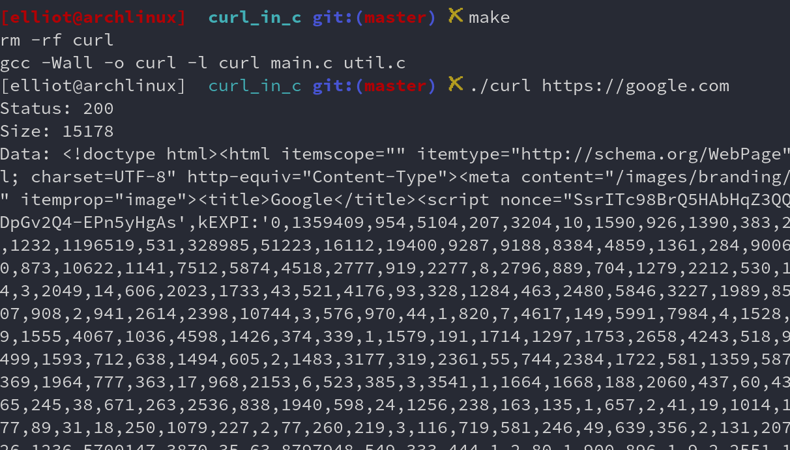

# Curl in C
> Coded by Gaurav Raj [TheHackersBrain]



## Version
**CURL v1.0**

## Uses
clone this repo
```
git clone https://github.com/thehackersbrain/curl_in_c.git
```
change directory
```
cd curl_in_c
```
make the binary file
```
make
```
run the binary
```
./curl <url>
```
ex
```
./curl https://google.com
```

## Credits
**Author : [HackerBrain](https://github.com/hackers-brain/)**

**HackersBrain : [HackTheBox](https://www.hackthebox.eu/profile/303514)**

**HackersBrain : [TryHackMe](https://tryhackme.com/p/hackersbrain)**

**Blog: [Here](https://thehackersbrain.pythonanywhere.com/)**
